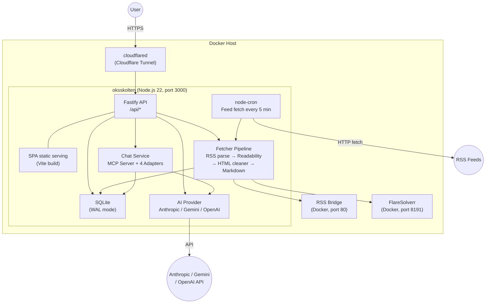

```mermaid
graph TD
    subgraph host["Docker Host"]
        subgraph app["oksskolten (Node.js 22, port 3000)"]
            fastify["Fastify API<br/>/api/*"]
            spa["SPA static serving<br/>(Vite build)"]
            sqlite["SQLite<br/>(WAL mode)"]
            cron["node-cron<br/>Feed fetch every 5 min"]
            fetcher["Fetcher Pipeline<br/>RSS parse → Readability<br/>→ HTML cleaner → Markdown"]
            ai["AI Provider<br/>Anthropic / Gemini / OpenAI"]
            chat["Chat Service<br/>MCP Server + 4 Adapters"]

            fastify --> sqlite
            fastify --- spa
            fastify --> fetcher
            fastify --> ai
            fastify --> chat
            cron --> fetcher
            fetcher --> sqlite
            chat --> sqlite
            chat --> ai
        end

        bridge["RSS Bridge<br/>(Docker, port 80)"]
        flare["FlareSolverr<br/>(Docker, port 8191)"]
        tunnel["cloudflared<br/>(Cloudflare Tunnel)"]
    end

    user(("User")) -- "HTTPS" --> tunnel
    tunnel --> fastify
    cron -- "HTTP fetch" --> rss(("RSS Feeds"))
    fetcher --> bridge
    fetcher --> flare
    ai -- "API" --> llm_api(("Anthropic / Gemini<br/>/ OpenAI API"))

```
