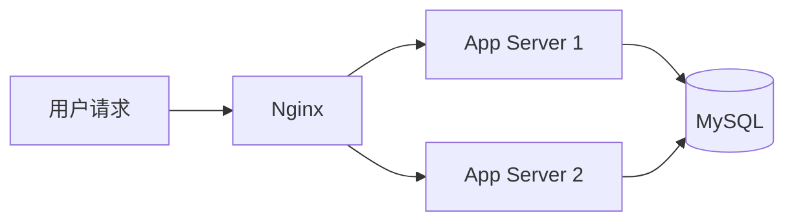
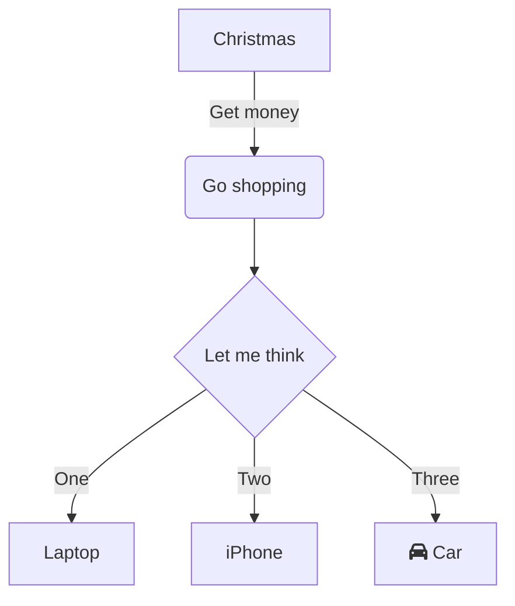

```mermaid
graph LR
  A[用户请求] --> B[Nginx]
  B --> C[App Server 1]
  B --> D[App Server 2]
  C --> E[(MySQL)]
  D --> E

```

---

0

```mermaid
graph TD
    A[Christmas] -->|Get money| B(Go shopping)
    B --> C{Let me think}
    C -->|One| D[Laptop]
    C -->|Two| E[iPhone]
    C -->|Three| F[fa:fa-car Car]
```

0