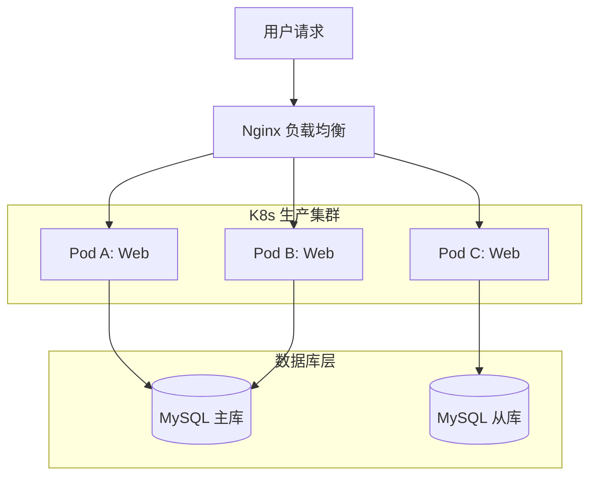
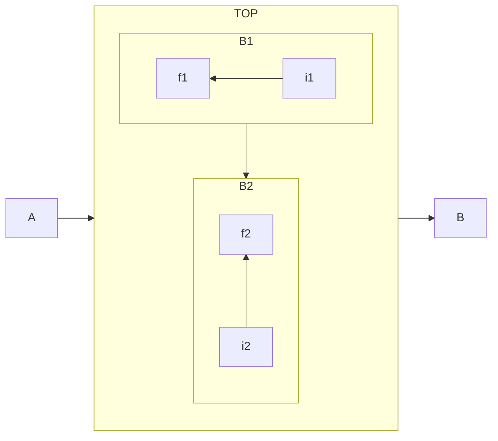

0

```mermaid
graph TD
    User[用户请求] --> LB[Nginx 负载均衡]
    
    subgraph Cluster_K8s [K8s 生产集群]
        direction LR
        Pod1[Pod A: Web]
        Pod2[Pod B: Web]
        Pod3[Pod C: Web]
    end
    
    subgraph Cluster_DB [数据库层]
        Master[(MySQL 主库)]
        Slave[(MySQL 从库)]
    end

    LB --> Pod1
    LB --> Pod2
    LB --> Pod3
    
    Pod1 --> Master
    Pod2 --> Master
    Pod3 --> Slave
```

**Direction in subgraphs**

```mermaid
flowchart LR
  subgraph TOP
    direction TB
    subgraph B1
        direction RL
        i1 -->f1
    end
    subgraph B2
        direction BT
        i2 -->f2
    end
  end
  A --> TOP --> B
  B1 --> B2
```

