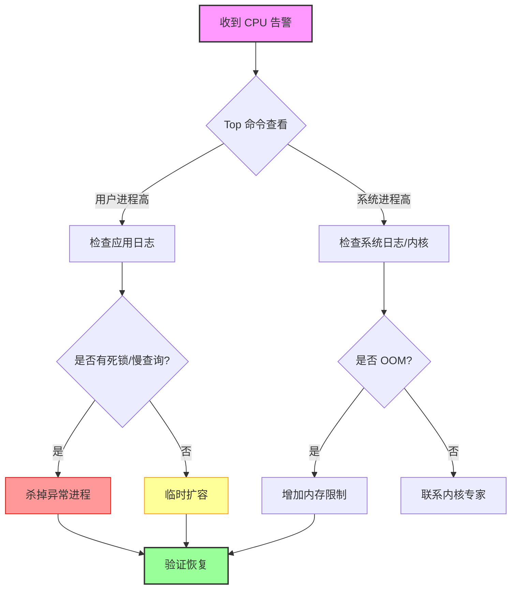

0

```mermaid
graph TD
    Start[收到 CPU 告警] --> CheckTop{Top 命令查看}
    
    CheckTop -- 用户进程高 --> AppLog[检查应用日志]
    CheckTop -- 系统进程高 --> SysLog[检查系统日志/内核]
    
    AppLog --> DeadLock{是否有死锁/慢查询?}
    DeadLock -- 是 --> KillProc[杀掉异常进程]
    DeadLock -- 否 --> ScaleOut[临时扩容]
    
    SysLog --> OOM{是否 OOM?}
    OOM -- 是 --> IncreaseMem[增加内存限制]
    OOM -- 否 --> KernelBug[联系内核专家]
    
    KillProc --> Verify[验证恢复]
    ScaleOut --> Verify
    IncreaseMem --> Verify
    
    style Start fill:#f9f,stroke:#333,stroke-width:2px
    style Verify fill:#9f9,stroke:#333,stroke-width:2px
    style KillProc fill:#ff9999,stroke:#f00
    style ScaleOut fill:#ffff99,stroke:#f90
```

end