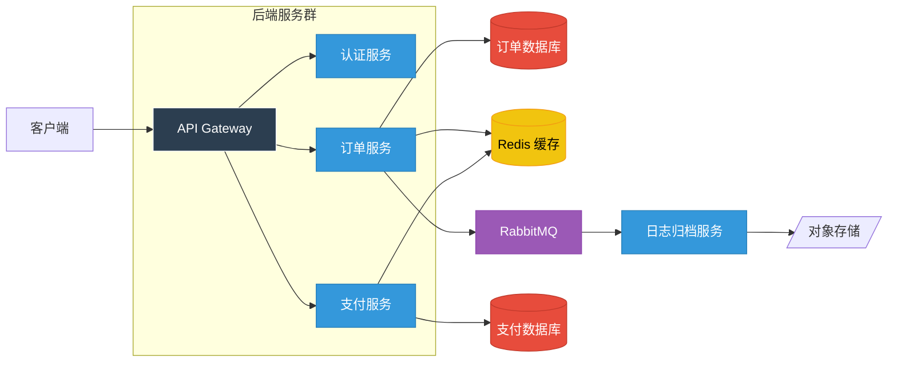

0

```mermaid
graph LR
    %% 定义样式类
    classDef gateway fill:#2c3e50,color:#fff,stroke:#fff;
    classDef service fill:#3498db,color:#fff,stroke:#2980b9;
    classDef db fill:#e74c3c,color:#fff,stroke:#c0392b;
    classDef cache fill:#f1c40f,color:#000,stroke:#f39c12;
    classDef mq fill:#9b59b6,color:#fff,stroke:#8e44ad;

    Client[客户端] --> GW[API Gateway]:::gateway
    
    subgraph Backend [后端服务群]
        GW --> Auth[认证服务]:::service
        GW --> Order[订单服务]:::service
        GW --> Pay[支付服务]:::service
    end

    Order --> DB_Order[(订单数据库)]:::db
    Order --> Redis[(Redis 缓存)]:::cache
    Order --> MQ[RabbitMQ]:::mq
    
    Pay --> DB_Pay[(支付数据库)]:::db
    Pay --> Redis

    MQ --> LogService[日志归档服务]:::service
    LogService --> S3[/对象存储/]
```

end