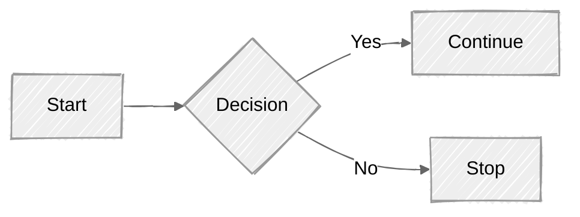
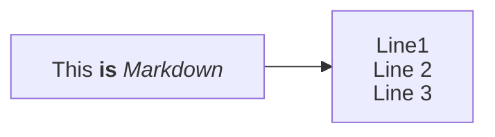
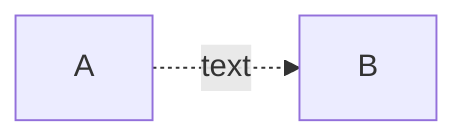
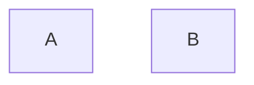
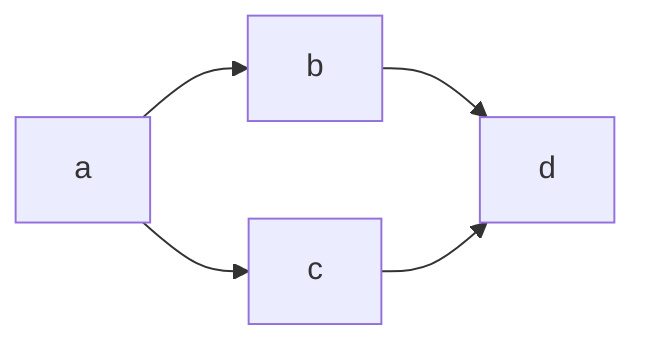
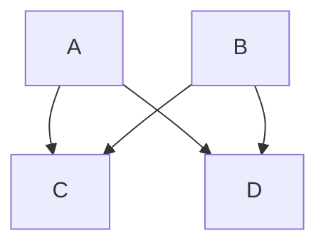

0

```mermaid
---
config:
  look: handDrawn
  theme: neutral
---
flowchart LR
  A[Start] --> B{Decision}
  B -->|Yes| C[Continue]
  B -- No --> D[Stop]

```

**支持 Markdown 格式：**

```mermaid
---
config:
  htmlLabels: false
---
flowchart LR
    markdown["`This **is** _Markdown_`"]
    newLines["`Line1
    Line 2
    Line 3`"]
    markdown --> newLines
```

**节点样式：**

https://mermaid.js.org/syntax/flowchart.html#node-shapes

**连接线：**

```mermaid
flowchart LR
   A-.->B;
```

```mermaid
flowchart LR
   A-. text .-> B
```

不可见的连接线，当你想要改变默认位置的时候 --

```mermaid
flowchart LR
    A ~~~ B
```

在一行定义多个连接线：

```mermaid
flowchart LR
   a --> b & c--> d
```

```mermaid
flowchart TB
    A & B--> C & D
```

